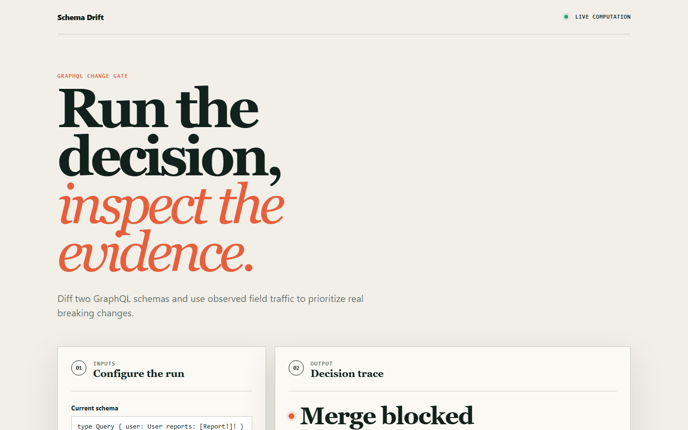
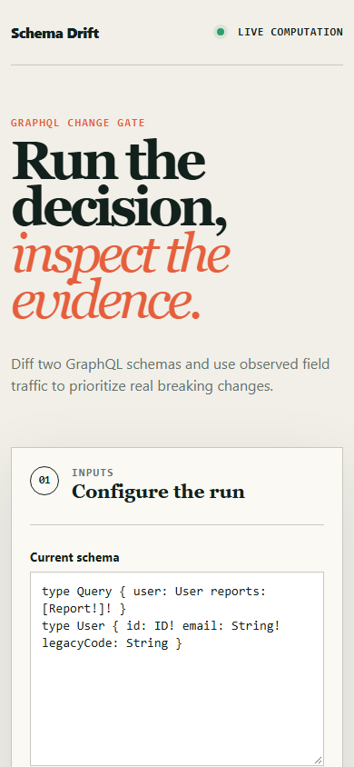

# schemadrift

> A GraphQL breaking-change gate that downgrades severity using real field-usage telemetry, so the gate stays worth reading.

## Live deployment

[](https://github.com/SlateGitOrg/schemadrift/actions/workflows/ci.yml)

[Open the working Schema Drift application](https://slategitorg.github.io/schemadrift/)

This deployed application runs the project's decision workflow in the browser. Change the inputs, run the analysis, and inspect the computed metrics and decision trace.

### Desktop



### Mobile



`COMPACT` · **Full Stack Engineering** · Intermediate · ~4-5 days · API platform teams

**Primary language:** TypeScript
**Tags:** `graphql`, `ci`, `developer-tooling`, `cli`, `contracts`

---

## The problem

Schema checks flag every removed field as breaking. Teams then either block harmless deletions for months or learn to click through the warning - at which point the gate has stopped working entirely, while still appearing in every CI run as reassuring green-and-red noise.

## ⭐ The differentiator

Each change is classified against **actual field-usage telemetry over a rolling window**: removing a deprecated field with zero requests in 30 days is SAFE; removing a field one client still calls is BREAKING, **with that client named**. A generic diff tool treats the schema as the only input and therefore produces an alert stream whose signal-to-noise ratio guarantees it will be ignored.

This is the sentence to lead with when someone asks you to walk through the
project. Everything else in this repo exists to make it true and to prove it.

## Data

GraphQL SDL pairs from public schemas (GitHub's published schema, Shopify's public SDL) as diff fixtures, plus a synthetic usage-log generator with documented client/field access patterns so severity-downgrade behaviour is verifiable.

> No paid API key is required to run or demo this project. Where a paid
> service would add value it is wired as an optional enhancement behind an
> interface with an offline mock as the default implementation.

## Stack

- TypeScript, graphql-js for AST-level diffing
- Node CLI + a GitHub Action wrapper
- Vitest with golden-file fixtures

## Core capabilities

- Structural diff producing a typed change list with rule-based severity
- Usage-log ingestion with per-field, per-client access windows
- Severity downgrade with the justification recorded in the output, not applied silently
- GitHub Action mode posting an annotated PR comment
- JSON and human-readable reporters

## Repository layout

```
src/diff/
src/usage/
src/report/
fixtures/                 # schema pairs + usage logs
test/
```

## Build plan

1. AST diff with severity rules first; get the golden files stable.
2. Add usage ingestion and the downgrade path, with the reason always recorded.
3. Wrap as a GitHub Action and post a real PR comment - that comment is your recruiter artefact.

## Testing strategy

Golden-file diffs across 30 schema-pair fixtures. The behavioural test that matters: assert a field's severity **changes correctly as its usage window empties**, and that a field with a single remaining caller is never downgraded.

Tests assert **correctness**, not merely that the code runs. A green suite on
this repo is a claim about behaviour under adversarial conditions; treat any
test that would pass against a deliberately broken implementation as a bug in
the test.

## Measurable outcome

> Deprecated-field removals that used to sit blocked for a quarter now merge the day their usage hits zero, while genuinely breaking changes name the client that will break.

State it in these terms — business units, not technical ones — in your CV
bullet and in the first thirty seconds of describing the project.

## Interview questions this project answers

- **How do you keep a CI gate from being ignored?**
- **What is a breaking change in a GraphQL schema, precisely?**

## What this deliberately is *not*

- Not a schema registry. It is one gate, done properly.


## Run it now

```bash
npm test        # runs the suite; no install step needed
npm run demo    # the 60-second artefact
```

Requires Node 22.6+ (24 recommended). TypeScript runs natively via
type stripping - there is no build step and no `node_modules`.

## Getting started

```bash
git clone <your-fork-url> schemadrift
cd schemadrift
npm install
npm run build
npx schemadrift diff --old fixtures/a.graphql --new fixtures/b.graphql \
  --usage fixtures/usage.jsonl
npm test
```

Docker is supported but optional — every path above works on a plain
Windows/macOS/Linux laptop without a cloud account.

## Definition of done

- [ ] The differentiator above is implemented, and a test proves it
- [ ] The measurable outcome is produced by a command anyone can run
- [ ] `README` explains the one decision a generic version gets wrong
- [ ] CI runs the full suite on every push and is green on `main`
- [ ] A recruiter can see the headline artefact in under 60 seconds

## Licence

MIT — see [LICENSE](LICENSE).
